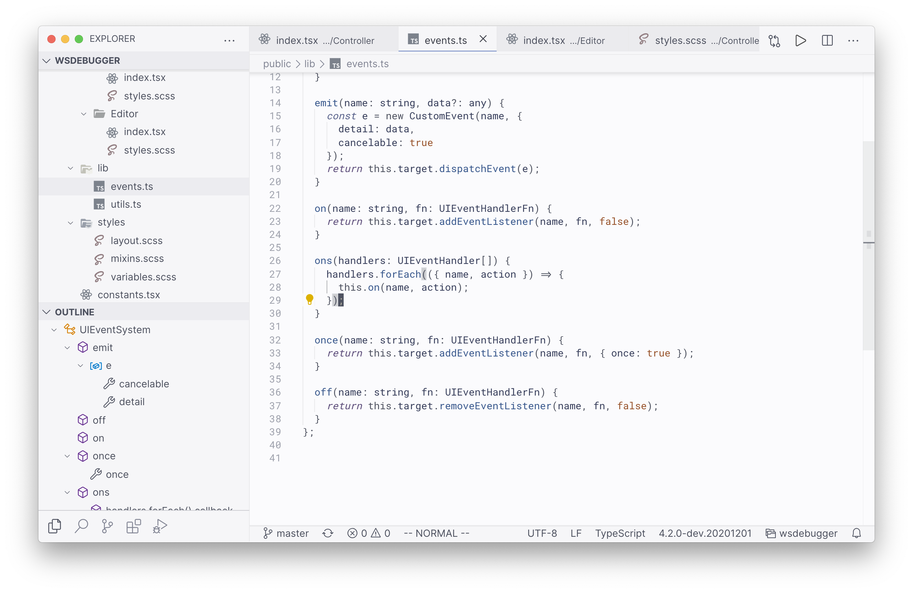

# Tokyo City

Tokyo City is a combination between [Tokyo Night](https://marketplace.visualstudio.com/items?itemName=enkia.tokyo-night) and [City Lights](https://marketplace.visualstudio.com/items?itemName=Yummygum.city-lights-theme) themes.

It bring the neon-bright style of Tokyo Night for anyone who loves the dark blue-ish background of City Lights.

**Installation:**

You can install this theme via:

- Visual Studio Marketplace: https://marketplace.visualstudio.com/items?itemName=huytd.tokyo-city
- Open VSX Registry: https://open-vsx.org/extension/huytd/tokyo-city
- Or compile it from source with [vsce](https://code.visualstudio.com/api/working-with-extensions/publishing-extension#vsce)